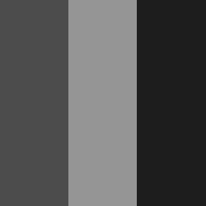
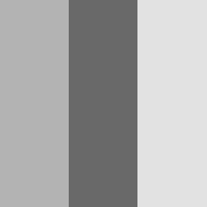
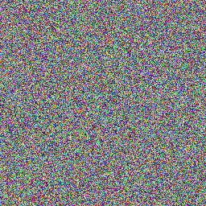
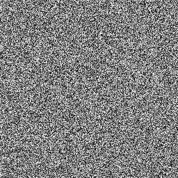
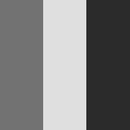
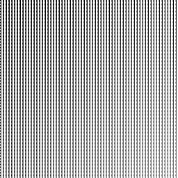
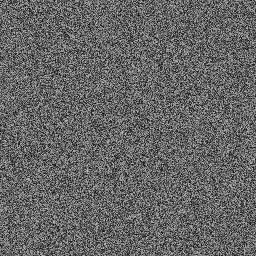
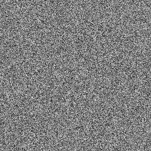
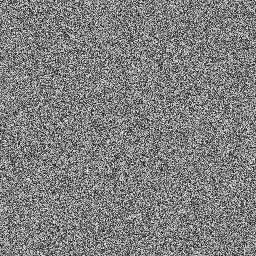

# CUDA Image Filter Test Report

**Generated:** 2026-02-04 16:36:21

## Summary

- **Total Tests:** 24
- **Passed:** 24 ✓
- **Failed:** 0 ✗
- **Success Rate:** 100%

## Single Filter Tests

### ✓ stripe_256x256_greyscale

**Filters:** `greyscale`

| Input | Output |
|-------|--------|
|  |  |

---

### ✓ stripe_256x256_invert

**Filters:** `invert`

| Input | Output |
|-------|--------|
|  |  |

---

### ✓ stripe_256x256_normalize

**Filters:** `normalize`

| Input | Output |
|-------|--------|
|  |  |

---

### ✓ stripe_256x256_threshold_0.3

**Filters:** `threshold --threshold 0.3`

| Input | Output |
|-------|--------|
|  |  |

---

### ✓ stripe_256x256_threshold_0.7

**Filters:** `threshold --threshold 0.7`

| Input | Output |
|-------|--------|
|  |  |

---

### ✓ gradient_256x256_greyscale

**Filters:** `greyscale`

| Input | Output |
|-------|--------|
|  |  |

---

### ✓ gradient_256x256_invert

**Filters:** `invert`

| Input | Output |
|-------|--------|
|  |  |

---

### ✓ gradient_256x256_normalize

**Filters:** `normalize`

| Input | Output |
|-------|--------|
|  |  |

---

### ✓ gradient_256x256_threshold_0.3

**Filters:** `threshold --threshold 0.3`

| Input | Output |
|-------|--------|
|  |  |

---

### ✓ gradient_256x256_threshold_0.7

**Filters:** `threshold --threshold 0.7`

| Input | Output |
|-------|--------|
|  |  |

---

### ✓ circles_256x256_greyscale

**Filters:** `greyscale`

| Input | Output |
|-------|--------|
|  |  |

---

### ✓ circles_256x256_normalize

**Filters:** `normalize`

| Input | Output |
|-------|--------|
|  |  |

---

### ✓ noise_256x256_channel_0

**Filters:** `channel --channel 0`

| Input | Output |
|-------|--------|
|  |  |

---

### ✓ noise_256x256_channel_1

**Filters:** `channel --channel 1`

| Input | Output |
|-------|--------|
|  |  |

---

### ✓ noise_256x256_channel_2

**Filters:** `channel --channel 2`

| Input | Output |
|-------|--------|
|  |  |

---

## Filter Chain Tests

### ✓ chain_greyscale_brightness_invert

**Filters:** `greyscale brightness --brightness 1.5 invert`

#### Filter Progression

| Step | Filters Applied | Result |
|------|-----------------|--------|
| 0 | (input) |  |
| 1 | greyscale |  |
| 2 | brightness --brightness 1.5 |  |
| 3 | invert |  |

---

### ✓ chain_normalize_threshold_brightness

**Filters:** `normalize threshold --threshold 0.5 brightness --brightness 1.2`

#### Filter Progression

| Step | Filters Applied | Result |
|------|-----------------|--------|
| 0 | (input) |  |
| 1 | normalize |  |
| 2 | threshold --threshold 0.5 |  |
| 3 | brightness --brightness 1.2 |  |

---

### ✓ chain_greyscale_invert_normalize

**Filters:** `greyscale invert normalize`

#### Filter Progression

| Step | Filters Applied | Result |
|------|-----------------|--------|
| 0 | (input) |  |
| 1 | greyscale |  |
| 2 | invert |  |
| 3 | normalize |  |

---

### ✓ chain_brightness_invert

**Filters:** `brightness --brightness 0.8 invert`

#### Filter Progression

| Step | Filters Applied | Result |
|------|-----------------|--------|
| 0 | (input) |  |
| 1 | brightness --brightness 0.8 |  |
| 2 | invert |  |

---

## Format Compatibility Tests

### ✓ format_stripe_256x256

**Filters:** `greyscale`

| Input | Output |
|-------|--------|
|  |  |

---

### ✓ format_gradient_256x256

**Filters:** `greyscale`

| Input | Output |
|-------|--------|
|  |  |

---

### ✓ format_circles_256x256

**Filters:** `greyscale`

| Input | Output |
|-------|--------|
|  |  |

---

### ✓ format_noise_256x256

**Filters:** `greyscale`

| Input | Output |
|-------|--------|
|  |  |

---

### ✓ format_real_world_256x256

**Filters:** `greyscale`

| Input | Output |
|-------|--------|
|  |  |

---

